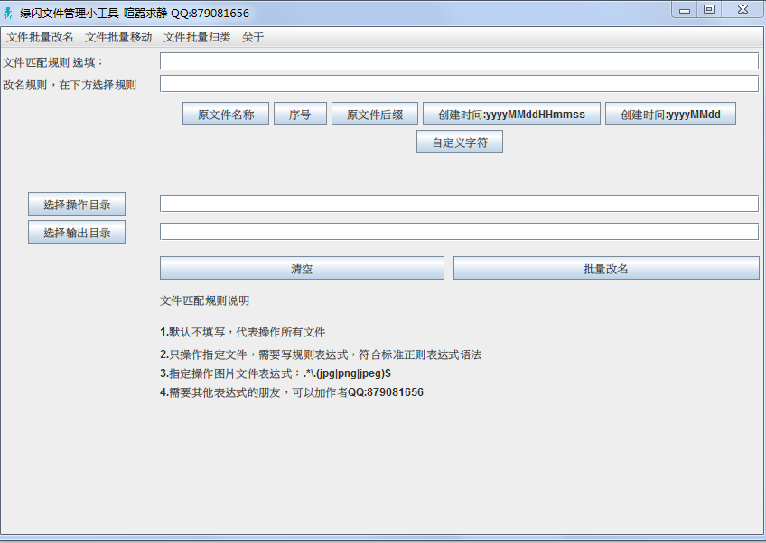

# GFileManager

#### 介绍
绿闪文件管理小工具
java gui文件批量改名，移动，归档等功能，可以提升工作效率
不能商用售卖，可以免费使用
软件release可以在 下载使用说明.txt.txt 文档里面获取

jar太大，超过10M上传不了，只能放网盘
https://pan.baidu.com/s/1wGACsaKkZU3acxbe7LO95g?pwd=6u4b

QQ交流1群：941955968

#### 软件架构
软件架构说明
Java swing gui

#### 安装教程

1.  xxxx
2.  xxxx
3.  xxxx

#### 使用说明

1.  xxxx
2.  xxxx
3.  xxxx

#### 参与贡献

1.  Fork 本仓库
2.  新建 Feat_xxx 分支
3.  提交代码
4.  新建 Pull Request

#### 特技

1.  使用 Readme\_XXX.md 来支持不同的语言，例如 Readme\_en.md, Readme\_zh.md
2.  Gitee 官方博客 [blog.gitee.com](https://blog.gitee.com)
3.  你可以 [https://gitee.com/explore](https://gitee.com/explore) 这个地址来了解 Gitee 上的优秀开源项目
4.  [GVP](https://gitee.com/gvp) 全称是 Gitee 最有价值开源项目，是综合评定出的优秀开源项目
5.  Gitee 官方提供的使用手册 [https://gitee.com/help](https://gitee.com/help)
6.  Gitee 封面人物是一档用来展示 Gitee 会员风采的栏目 [https://gitee.com/gitee-stars/](https://gitee.com/gitee-stars/)
